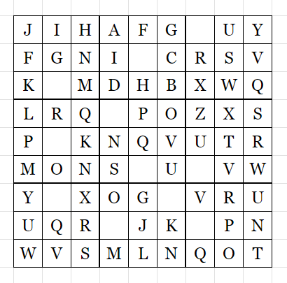

|Field|Value|
|---|---|
|**Author**|Illyngo (Bird)|
|**Difficulty**|⭐⭐|
|**Solved**|Yes|
|**Original**|https://discord.com/channels/1042924100760391710/1110625554476040323/1146614027875794954|

**Prompt**
>  

Solution

The grid contains all letters from A to Y with each 3x3 subgrid containing sets of consecutive letters

The empty spaces can be filled with 'LETSTRYTIHS' L to R, T to B which not only is a reasonable sentence but also fits with the sudoku criteria alluded by the format of the table

The 'T' and 'I' in the last row are inverted because of the reading convention T to B (read B to T would yield 'LETSTRYTHIS')

