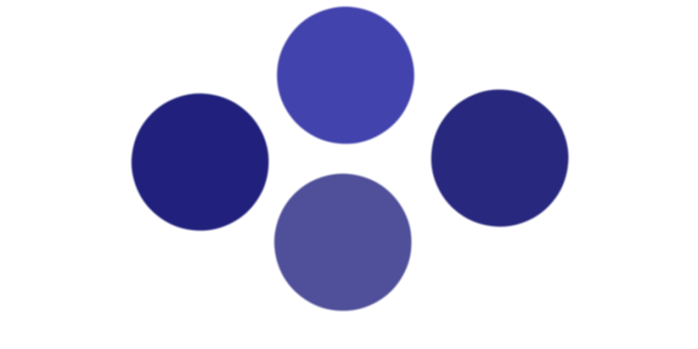

|Field|Value|
|---|---|
|**Author**|CapnStarisa|
|**Difficulty**|⭐⭐⭐|
|**Solved**|Yes|
|**Original**|https://discord.com/channels/1042924100760391710/1110625554476040323/1149628035608354846|

**Prompt**
> If this code is not for the Blind, Who's it for?
>
>  

Solution

  
The four circles are filled with four distinct colors which read in hex give

- 21217D for the circle to the left
- 4343AE for the upper one 
- 4F4F9A for the bottom one
- 4343AE for the one to the right

The last digits read 'DEAF' which is the answer to the original question (is not for 'Blind' but for 'Deaf')

