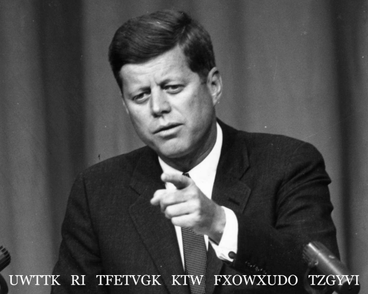

|Field|Value|
|---|---|
|**Author**|Illyngo (Bird)|
|**Difficulty**|⭐⭐|
|**Solved**|Yes|
|**Original**|https://discord.com/channels/1042924100760391710/1110625554476040323/1150545168253071400|

**Prompt**
> What does this say?
>
>  

Solution

  
Each word is encrypted with a Caeser cipher with a certain key
A brute force approach showed the words were encrypted with the keys 5 3 17 5 3 17, making the original text 'PROOF OF CONCEPT FOR CULTURAL CIPHER'
Caeser ciphers have keys which are 26-periodic meaning key 3 and key 29 would yield the same result
5/29/17 is the birthdate (mm/dd/yy) of John Fitzgerald Kennedy, the man represented in the image

