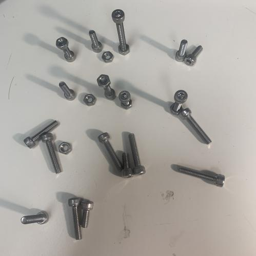

|Field|Value|
|---|---|
|**Author**|Illyngo (Bird)|
|**Difficulty**|⭐|
|**Solved**|Yes|
|**Original**|https://discord.com/channels/1042924100760391710/1110625554476040323/1151332694958014544|

**Prompt**
> What does this say?
>
>  

Solution

  
The placed objects are nuts and bolts
Some of the bolts are either placed vertically or horizontally
Viewing the image from the top the upstanding bolts and the nuts would look like dots whereas the bolts lying down would look like dashes
The groups of nuts and bolts can be read in morse as 'hagotem', so 'ha got'em'
The solution probably refers to the use of (these) nuts to make the code 

