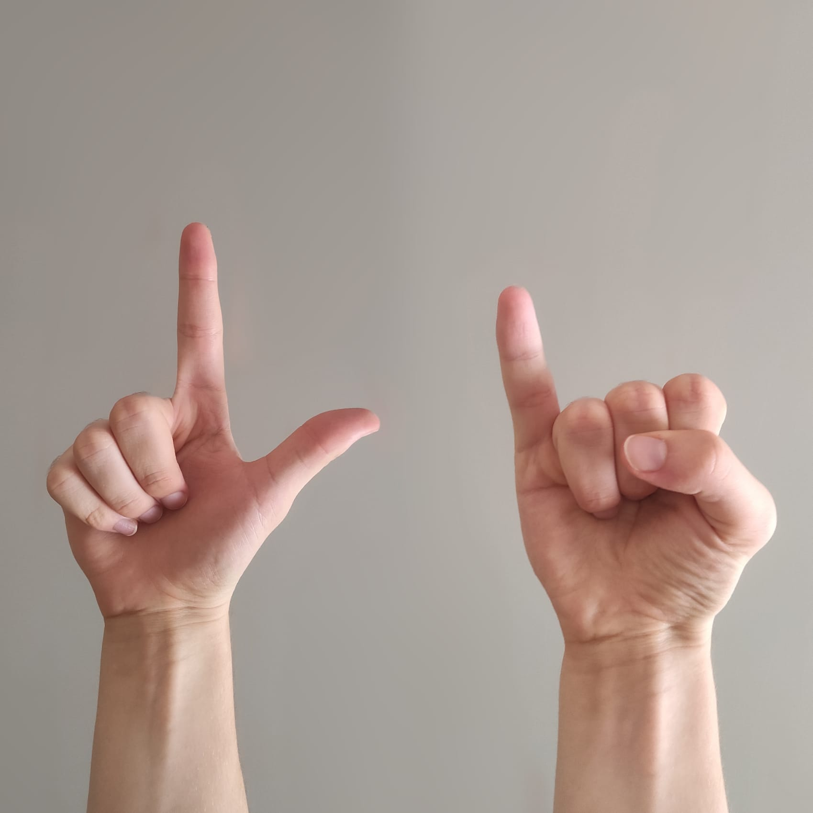

|Field|Value|
|---|---|
|**Name**|Prof W's cipher homework #1|
|**Author**|Atelos (Wattia)|
|**Difficulty**|⭐⭐|
|**Solved**|Yes|
|**Original**|https://discord.com/channels/1042924100760391710/1152554684796645416|

**Prompt**
> Japanese people really have a strange way of counting. I asked my Japanese friend how much he got on his last music exam. He said he failed and all he sent was this:
>
> 

Solution

In the Japanese sign language the hand gestures read 'れい' or 're i' in hiragana

're i' read together mean 0, thus the mentioned friend got a 0 (reason being he is deaf)

