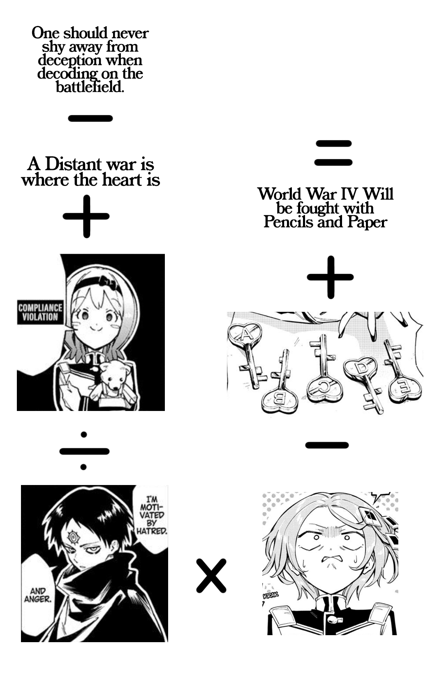

|Field|Value|
|---|---|
|**Name**|Starisa Cipher #1|
|**Author**|CapnStarisa|
|**Difficulty**|⭐⭐⭐|
|**Solved**|Yes|
|**Original**|https://discord.com/channels/1042924100760391710/1152682964833017949|

**Prompt**
> What's next?
>
> 

Solution

Each text refers to a Cipher Academy chapter

The one on the top left corner refers to chapter 20, the one below it 9 and the one on the right chapter 1

The original panels of each image contained, excluding the class number 1A, exactly one number

Following the operations those numbers were 16, 3, 5 and 6

The solution is therefore the result of the operation

$$
20 - 9 + 16 / 3 \cdot 5 - 6 + 1
$$

Following the standard multiplication first, addition last order of operation we would get a fractional number

The intended way to calculate the number is progressively ignoring any precedence rule for multiplication and following the layout of the code

Doing so the result would be $40$ which was the upcoming Cipher Academy chapter when the cipher was publised

