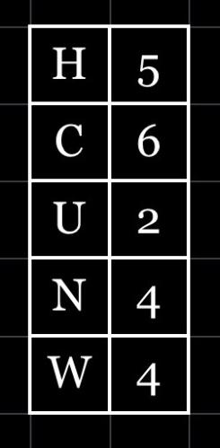

|Field|Value|
|---|---|
|**Author**|Illyngo (Bird)|
|**Difficulty**|⭐⭐⭐|
|**Solved**|No|
|**Original**|https://discord.com/channels/1042924100760391710/1110625554476040323/1146646656893341697|

**Prompt**
> 
>
> What do soldiers use when their phones go down

<details>
<summary>Solution</summary>
Each letter in the first column can be written out using american military phonetics as

```
HOTEL
CHARLIE
UNIFORM
NOVEMBER
WHISKEY
```

The second column represents the position of a letter to be extracted from these words

Excrating from each word the associated letter we read

```
L
I
N
E
S
```

Thus the solution is 'lines' which can be interpreted as communicating using 'lines and dots', morse code or 'sniffing a line'
</details>
