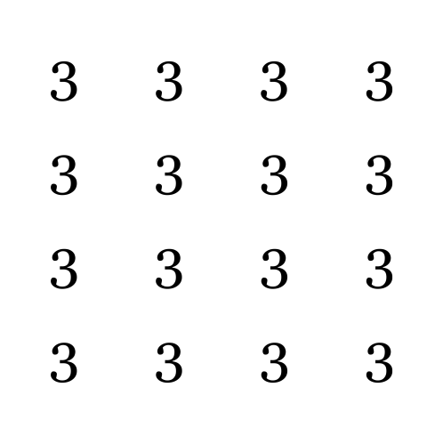

|Field|Value|
|---|---|
|**Author**|Illyngo (Bird)|
|**Difficulty**|⭐⭐|
|**Solved**|Yes|
|**Original**|https://discord.com/channels/1042924100760391710/1110625554476040323/1149593706761027656|

**Prompt**
> A number is hidden in this image that is not like the others. What is that number?
> 
>  

Solution

The image sizes are 3333x3339

The hidden number is 9

