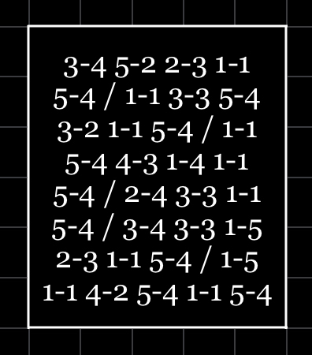

|Field|Value|
|---|---|
|**Name**|Bird's Weekly Puzzle #5|
|**Author**|Illyngo (Bird)|
|**Difficulty**|⭐️⭐️⭐️|
|**Solved**|Yes|
|**Original**|https://discord.com/channels/1042924100760391710/1152664351459790958|

**Prompt**
> For how long can Iroha practice Tap dancing?
>
>  

<details>
<summary>Solution</summary>
Each couple of numbers represent a letter in tap code

Using the table

```
A B C/K D E
F G H   I J
L M N   O P
Q R S   T U
V W X   Y Z
```

the numbers read 'ONEYEAR'

Thus Iroha can practice tap dancing for 'one year'
</details>
