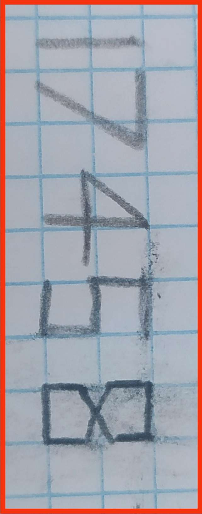

|Field|Value|
|---|---|
|**Author**|Ipols|
|**Difficulty**|⭐⭐|
|**Solved**|Yes|
|**Original**|https://discord.com/channels/1042924100760391710/1152508587730546710|

**Prompt**
> Someone lost this piece of paper. Anyone knows who does it belong to?
>
>  

Solution

The number of straight lines in each digits are respectively 1, 2, 3, 5 and 8

These numbers follow the Fibonacci series' recurrence where you sum the previous 2 numbers to get the next one

The person that lost the piece of paper is thus Fibonacci

